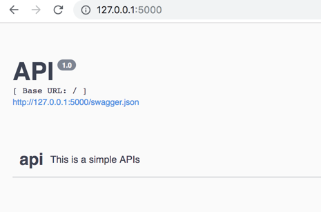
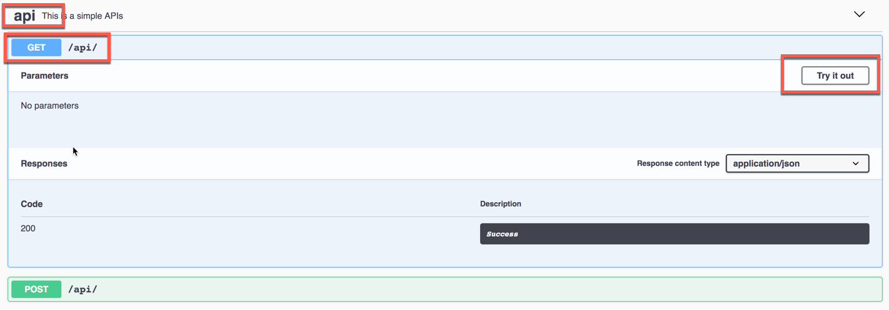
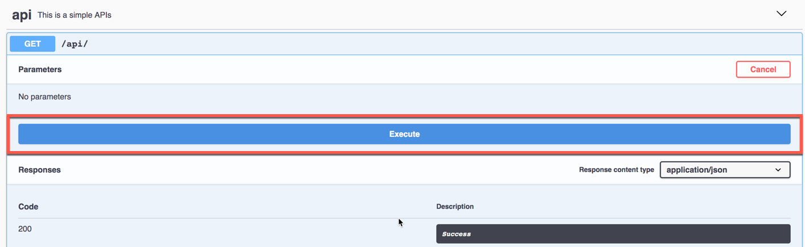
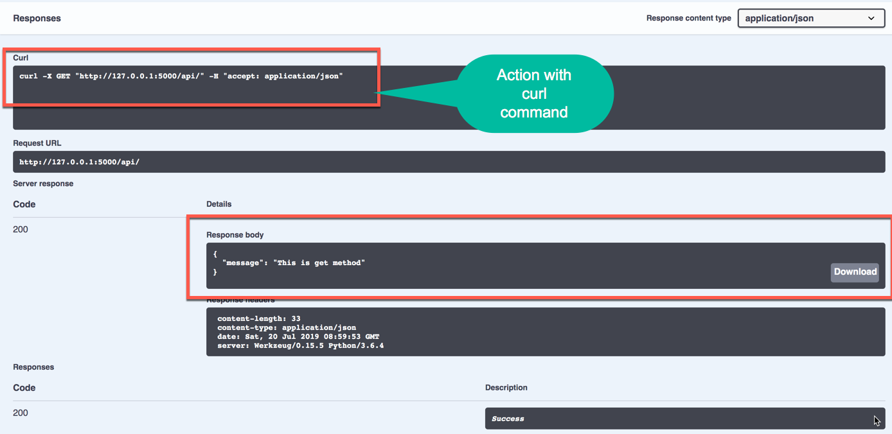
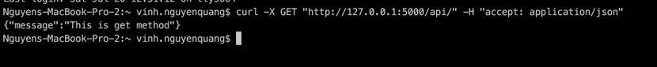
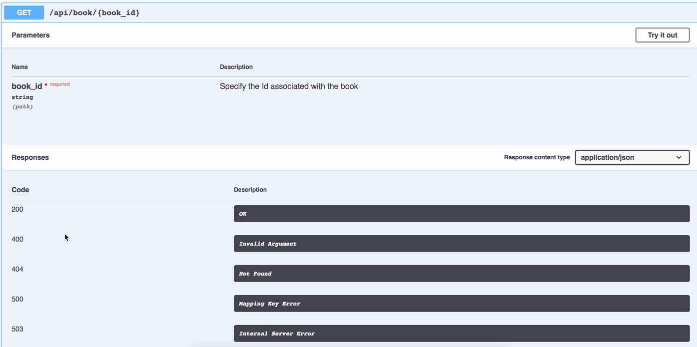
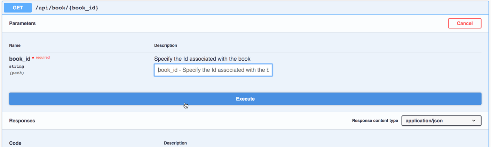
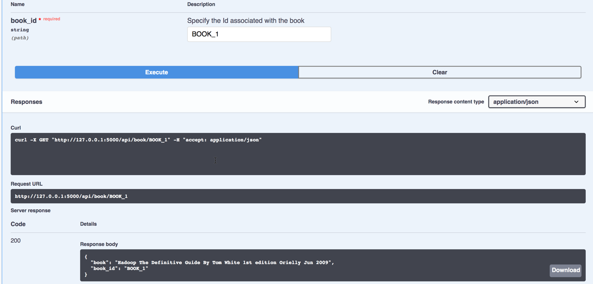
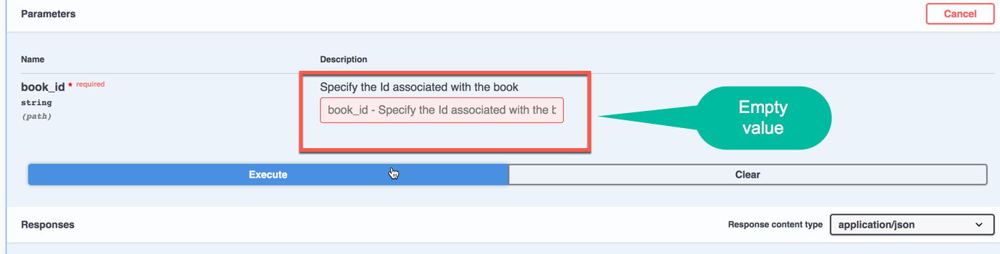
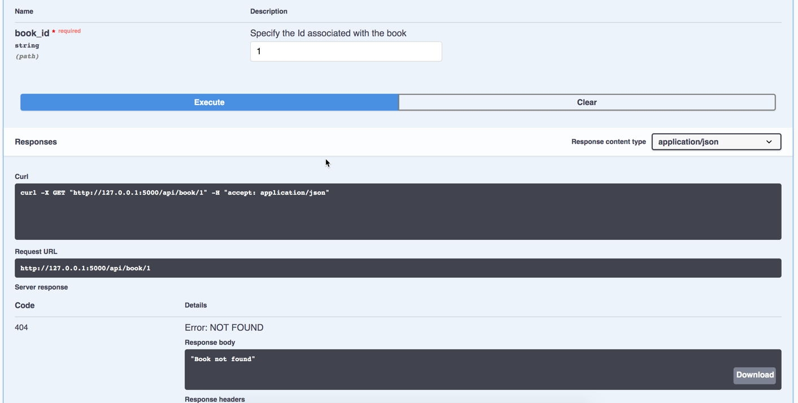

Sample for working with APIs using Flask, Flask-RESTPlus and Swagger UI


# Installation

Create a new Python3 evironment, start this evironment and run bellow command to install some python packages


`pip install -r requiremens.txt `


# Build basic application

This project is a very simple application, base on `flask_app.py` file.

Open `flask_app.py` and insert this code:


## Import package


```python
from flask import Flask, jsonify
from flask_restplus import Api, Resource
```


## Define flask_app

```python
flask_app = Flask(__name__)
app_api = Api(app=flask_app)

api_name_space = app_api.namespace('api', description='This is a simple APIs')

```

## Define APIs

Create simple api with `get` and `post` method

```python

@api_name_space.route("/")
class MainApis(Resource):
    def get(self):
        return jsonify({"message": "This is get method"})

    def post(self):
        return jsonify({"message": "this is post method"})
```


## Running
At the end of file, put 
```python
if __name__ == '__main__':
    flask_app.run()
```

In activate environment, start project with command


>python flask_app.py


```bash
* Serving Flask app "flask_app" (lazy loading)
 * Environment: production
   WARNING: This is a development server. Do not use it in a production deployment.
   Use a production WSGI server instead.
 * Debug mode: off
 * Running on http://127.0.0.1:5000/ (Press CTRL+C to quit)
```

Open your app in http://127.0.0.1:5000/, and get something:



Now, you can do something with Get, Post in front-end swagger







look like as you try in terminal




When you goto http://127.0.0.1:5000/swagger.json, you can show all code of this action

```json
{"swagger": "2.0", "basePath": "/", "paths": {"/api/": {"get": {"responses": {"200": {"description": "Success"}}, "operationId": "get_main_apis", "tags": ["api"]}, "post": {"responses": {"200": {"description": "Success"}}, "operationId": "post_main_apis", "tags": ["api"]}}}, "info": {"title": "API", "version": "1.0"}, "produces": ["application/json"], "consumes": ["application/json"], "tags": [{"name": "api", "description": "This is a simple APIs"}], "responses": {"ParseError": {"description": "When a mask can't be parsed"}, "MaskError": {"description": "When any error occurs on mask"}}}
```


# Build application with params.

## Query string

Create end-point to get/add new `book` 


Insert data for samle

```python
BOOKS = {
    "BOOK_1": "Hadoop The Definitive Guide By Tom White 1st edition Orielly Jun 2009",
    "BOOK_2": "Hadoop in Practice by Alex Holmes Manning 2012",
    "BOOK_3": "Learning Hadoop 2 - Garry Turkington PACKET Feb 2015",
    "BOOK_4": "Hadoop Real-World Solutions Cookbook By Jonathan R. Owens PACKT Feb 2013",
    "BOOK_5": "Hadoop Application Architectures By Mark Grover Jul 2015 Orielly"
}
```


Define response with detail HTTP_STATUS_CODEs
```python
request_responses = {200: 'OK', 400: 'Invalid Argument', 500: 'Mapping Key Error',
                     503: 'Internal Server Error', 404: 'Not Found'}
```


Define `get` end-point:

```Python
@api_name_space.route("/book/<string:book_id>")
class BookApi(Resource):
    @app_api.doc(responses=request_responses,
                 params={'book_id': 'Specify the Id associated with the book'}
                 )
    def get(self, **kwargs):
        try:
            book_id = kwargs.get('book_id', "")
            if book_id in BOOKS:
                return {"book": BOOKS[book_id], "book_id": book_id}, 200
            else:
                return "Book not found", 404
        except Exception as ex:
            return ex.__str__(), 503

```

Start debug application:











## Models parameter
In-comming